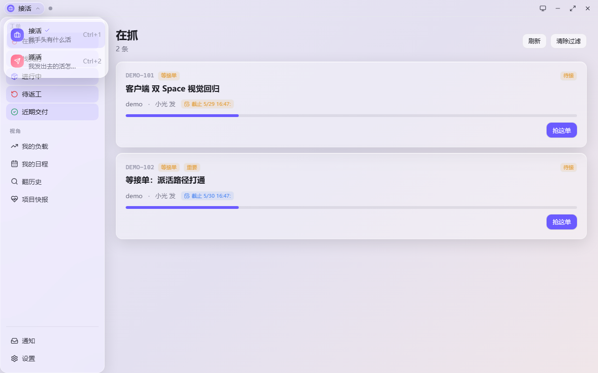
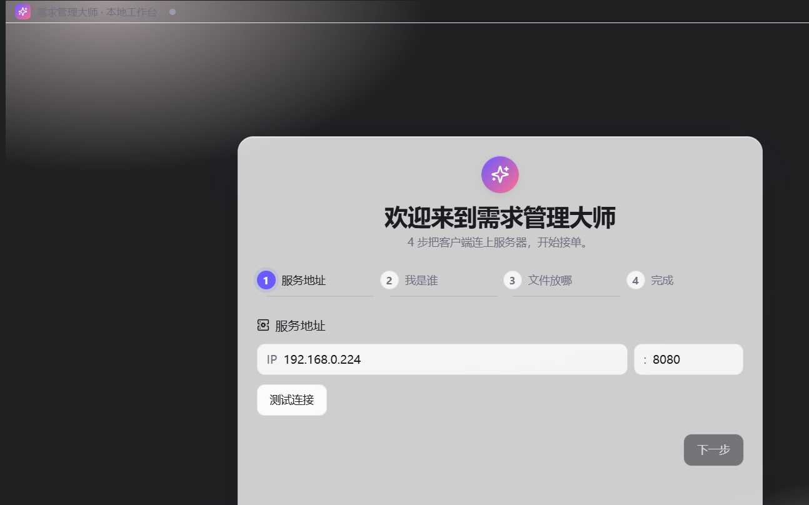
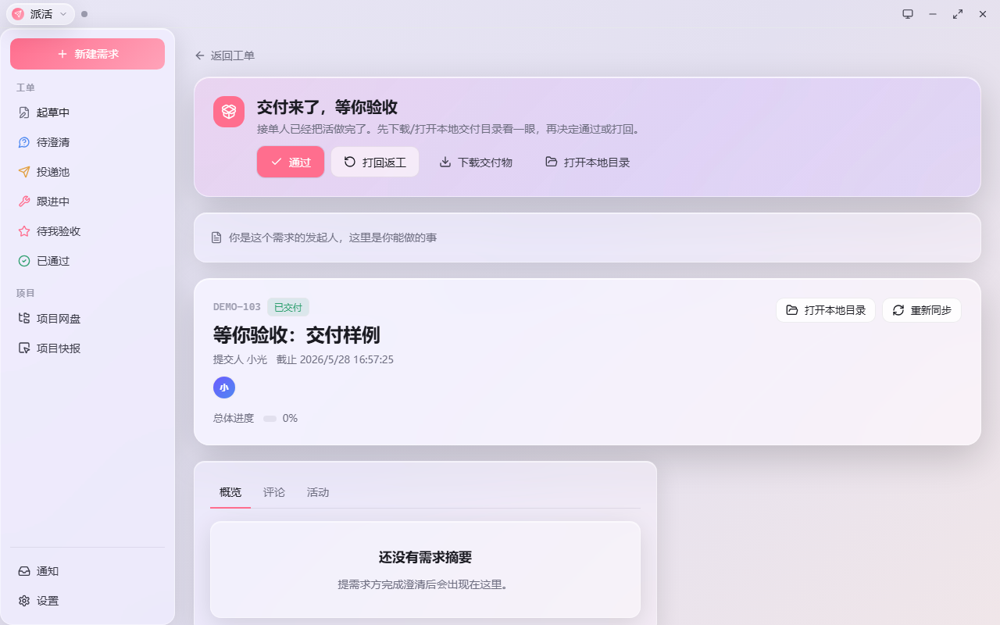

# 需求管理大师 · yqgl

> 一个 LAN 内网团队的 AI 原生需求中台：
> **派活的人** 把需求写出来 → AI 助理帮你澄清打磨 → 投递给团队 →
> **接活的人** 在桌面客户端接单、自动同步文件、把活做完交付 →
> **派活的人** 在 Win11 系统右下角弹窗收到「等你验收」→ 一键通过或打回。
>
> 全程不用追问"做完没"、不用群里 @ 谁。AI 写交付文档、文件自动同步、通知直达系统托盘。


[功能亮点](#功能亮点) · [架构](#架构) · [快速开始](#快速开始) · [开发](#开发) · [技术栈](#技术栈)

---

## 功能亮点

### 双 Space 工作模式

Arc Browser 风格的双视角切换 — 同一份数据，不同的滤镜：

| Space | 主色 | 心智模型 |
|---|---|---|
| **接活**（默认） | 电紫 `#6B5BFF` | "我手头有什么活？" |
| **派活** | 珊瑚 `#FF6E8E` | "我发出去的活怎么样了？" |

TitleBar 左上角 chip + `Ctrl+1` / `Ctrl+2` 切换。整个 chrome（侧栏、首页、主色变量）通过 native [View Transitions API](https://developer.mozilla.org/en-US/docs/Web/API/Document/startViewTransition) 平滑形变。



### AI 澄清流程

提交人写完原始描述（"做一个团队周报模板…"）后，跳到 AI 澄清页：DeepSeek 助理用 SSE 流式问澄清问题（多选/开放式），用户答几轮后 AI 自动生成结构化 `summary_md` + `title`，提交人确认 DDL 后投递。


### 接活闭环

接单人桌面客户端：
- **公共池 + 我的指派** 一屏看完
- **文件同步**：需求附件自动同步到 `D:\工作需求\{项目}\{编号}\`，spec/ 文件夹可开监听自动上传
- **交付**：选交付文件夹 → 自动 zip + 分片上传 + AI 写交付摘要
- **系统通知**：被指派、需求更新、AI 写完交付文档 → Win11 右下角弹窗 + 托盘红点

### 全流程通知

提交人不再需要追问"做完没"：
- **接走了** → normal 级通知
- **交付了等你验收** → high 级通知，系统右下角弹窗
- **被取消** → 双向通知（提交人和接单人）
- 全部走 SSE per-user channel，**绝不跨用户泄露**

### 管理员能力

`is_admin=true` 用户在 Settings 看到管理员面板：
- 新建 / 归档项目
- 添加 / 撤销管理员
- 软删用户（tombstone 昵称 + 撤销 cookie + 撤销 devices，无法自我复活）
- 按编号删除需求（自动归档相关通知避免死链接）
- 应急旁路：跳过 AI 直接投递

### 透明窗口

Win11 Acrylic 真透明 + Aurora Glass token 设计：



---

## 架构

```
┌──────────────────┐         ┌──────────────────────┐
│ Tauri 桌面客户端 │ ◀─SSE──▶│  FastAPI 后端 (8080) │
│  (Windows)       │  HTTPS  │   + SQLite + LLM     │
│  Aurora Glass UI │ ◀──────▶│   + 分片上传 + 通知  │
└──────────────────┘         └──────────────────────┘
        ▲                              ▲
        │ tray notifications           │
        │ spec/ folder watcher         │
        │                              │
┌───────┴──────────┐         ┌──────────┴───────────┐
│ Windows OS       │         │  Web (React/Vite)    │
│ (托盘 + 右下角)  │         │  浏览器入口 (Mac/Lin)│
└──────────────────┘         └──────────────────────┘
```

**关键决策：**

- **桌面客户端只做 Windows** — Mac 用户走 Web，避免 Tauri Mac 编译 + WebView2 不一致开销
- **后端单 uvicorn worker + SQLite** — LAN 部署，简单可靠；多 worker / Postgres 留待真有性能压力
- **AI 澄清强制走 LLM** — 跳过 AI 是 admin-only 应急旁路，正常流程必须 AI 澄清（避免接单人收到一句话需求）
- **SSE 分通道** — 全局 `requirement.*` 用 `/api/push/stream`，个人 `notification.*` 用 `/api/push/stream/me`（cookie-scoped，防跨用户泄露）

---

## 快速开始

### 我是用户

1. **本地浏览器**：访问 `http://<server>:8080/`
2. **下载桌面客户端**：浏览器横幅顶部有 "下载客户端" 按钮，或直接 `http://<server>:8080/downloads/yqgl-client-setup.exe`
3. **首次启动**：填昵称 → 选服务器地址 → 选本地工作目录 → 完成

### 我是部署者

```bash
# 后端 (Python 3.13+, FastAPI, SQLite)
cd app
pip install -r requirements.txt
python -m uvicorn main:app --host 0.0.0.0 --port 8080

# Web 前端 (React + Vite)
cd web
npm install
npm run build  # → web/dist/

# 部署到 /srv/yqgl/{app,web/dist,downloads}/ 后 systemd 拉起
systemctl restart yqgl-web
```

参考 [DEPLOY.md](DEPLOY.md) 完整步骤。

### 我是开发者

```bash
# Backend (hot reload)
cd app && uvicorn main:app --reload

# Web (Vite dev with proxy)
cd web && npm run dev

# Tauri 客户端 (cargo + Vite)
cd client-tauri && npm run tauri:dev
```

中文路径会让 cargo 编译失败 — `cd C:/dev/yqgl-ascii && npm run tauri:build` 走 ASCII 路径。

---

## 开发

### 仓库结构

```
app/                  # FastAPI 后端
├── routers/          # auth, requirements, chat, delivery, notifications, push, ...
├── services/         # lifecycle, notifications, llm_agent, push_bus, ...
├── models.py         # SQLAlchemy 2 (Mapped) — User, Requirement, Notification, ChatMessage, ...
└── main.py           # 路由挂载 + /downloads 静态 + SPA fallback

client-tauri/         # Tauri 桌面客户端 (Windows-only build)
├── src-tauri/        # Rust：sse / upload / spec_watch / commands
└── web-src/          # React + Aurora Glass
    └── src/
        ├── routes/   # Hub, HubDispatch, TaskDetail, Clarify, NewRequirement, ...
        ├── components/ # SpaceSwitcher, ActionRailDispatch, AdminPanel, ...
        └── lib/tauri.ts # invoke + clientFetch + SSE

web/                  # 浏览器入口 (Mac / Linux 用户)
└── src/
    ├── pages/        # Dashboard, NewRequirement, Clarify, RequirementDetail, ...
    └── components/   # AssigneeSelector, ClientDownloadBanner, ...

shared/               # 通用包 @yqgl/shared
└── src/
    ├── api/          # types + client
    ├── hooks/        # useTheme, useSpace, useChatStream, useViewerRole, ...
    ├── ui/           # Card, Button, Modal, Drawer, StatusBadge, Tabs, ...
    └── design/       # tokens.css (Aurora Glass), status-vocab

scripts/              # Python 部署 / 测试脚本
└── e2e_*.py          # 真后端 smoke 测试
```

### 关键模块

| 关注点 | 文件 |
|---|---|
| 需求状态机 | `app/routers/requirements.py:235-248` |
| 通知分发（claim/deliver/cancel） | `app/services/lifecycle.py` |
| AI 澄清流（SSE 流式） | `app/routers/chat.py` + `shared/src/hooks/useChatStream.ts` |
| 角色感知 UI | `shared/src/hooks/useViewerRole.ts` |
| 软删用户安全（4 处 auth lookup 加 deleted_at 过滤） | `app/auth.py` |
| 分片上传公共模块 | `client-tauri/src-tauri/src/upload.rs` |
| spec/ 文件夹自动同步 | `client-tauri/src-tauri/src/spec_watch.rs` |
| 双 Space + 主色变量切换 | `shared/src/hooks/useSpace.ts` + `shared/src/design/tokens.css` |

### 测试

```bash
# 真后端 E2E (Python httpx)
python scripts/e2e_client_onboarding.py   # 4-步 onboarding 链路
python scripts/e2e_submitter_remote.py    # 完整提交人链路：create → upload → submit → claim → deliver

# Web Playwright 截图回归
cd web && YQGL_USE_REMOTE=1 npx playwright test
```

测试用真后端，不 mock — 抓真实回归。

---

## 技术栈

- **后端**: FastAPI · SQLAlchemy 2 · SQLite · DeepSeek (Anthropic-兼容 API) · SSE
- **桌面客户端**: Tauri v2 · Rust · `notify` (file watch) · `window-vibrancy` (Acrylic)
- **共享前端**: React 18 · Vite 5 · TypeScript 5 · Tailwind · 自研 Aurora Glass 设计 tokens
- **测试**: Playwright (E2E + 截图回归) · Python httpx (真后端 smoke)

---

## 路线图

- [ ] Mac 桌面客户端（目前 Mac 用户走 Web）
- [ ] 全文搜索 + 历史知识库语义检索
- [ ] AI 助理自动完成简单需求（auto.py 已有骨架）
- [ ] 团队负载预测 + 自动派活推荐

---

## 截图

### 接活 Space


### 派活 wizard


### 待我验收


### Web 入口（带客户端下载横幅）


---

## License

MIT — see [LICENSE](LICENSE).
