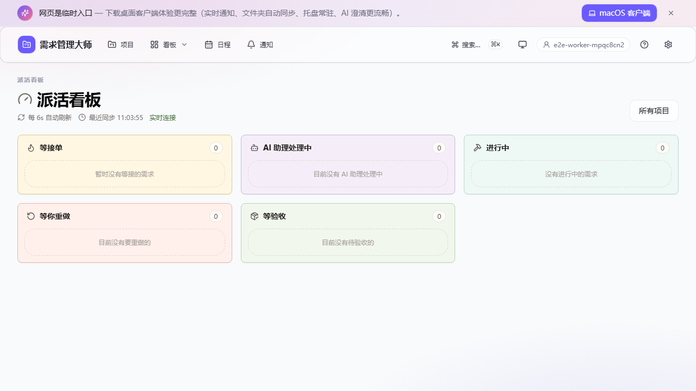
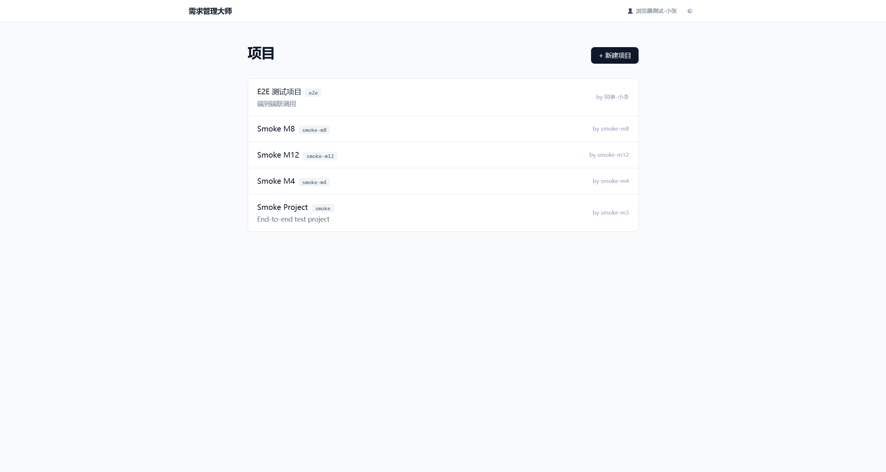
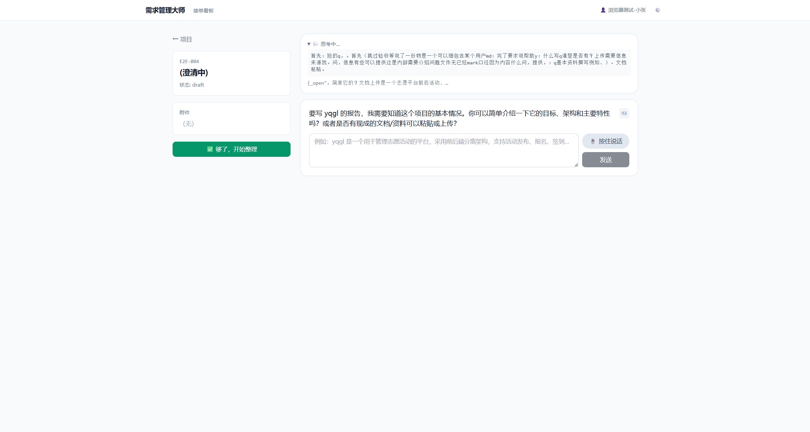
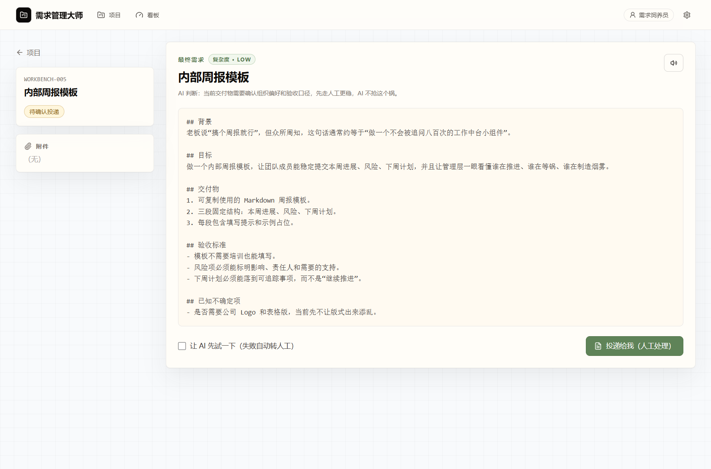

# 需求管理大师 · yqgl

> - 是不是想打死提需求的同事？
> - 是不是被产品经理一句"你看着办"气到吐血？
> - 是不是被老板"我有个想法很简单你随便弄一下"折磨到怀疑人生？
> - 是不是接到需求三天后才发现关键信息根本没说？
> - 是不是交付完客户才说"哦这不是我要的"？
>
> **来，把这堆人扔给 AI。** 你只管接单。

[English](#english-summary) · [架构](#架构) · [快速开始](#快速开始) · [路线图](#路线图)



---

## 它到底是什么

一个 **AI 原生** 的内网需求中台，把"提需求 → 接需求 → 做需求 → 交付"这条让所有打工人头大的链条**全自动化处理人的部分**：

```
   同事写一句模糊需求
        ↓
   LLM 反问澄清 (点选 + Other + 语音都行)
        ↓
   结构化需求文档 + 复杂度评估
        ↓
   ┌─ 简单 → AI 自己写代码 → 自动交付 (你压根不知道有过这事)
   │
   └─ 复杂 → 推到你本地 → 你做完 → 一键打包 → LLM 给客户写说明文档
```

## 它解决你哪些痛

| 你的痛 | 这玩意儿干了啥 |
|---|---|
| "需求像谜语，不澄清不知道做啥" | **LLM Agent 反问澄清**——选项式问答 + Other 自由补充 + 语音回答，问到 AI 自己觉得够了为止 |
| "拿到需求就 3 行字，附件还是图片" | 上传 PDF/Word/Excel/PPT 都解析成文本，对话历史 + 原始文件 + 摘要一起打包推过来 |
| "简单的需求也排队几天" | LLM 自评 `ai_doable`，简单的直接交给 AI agent 在沙箱里跑（写文件 + 跑 bash + 自测），失败自动转人工，你**完全无感** |
| "交付完了客户问'怎么用'" | 你打包上传后，LLM 自动读所有交付文件写**面向客户的交付文档**（含原需求映射表 + 已知局限） |
| "不知道现在多少单要处理" | 副屏挂个 dashboard 自动刷新，按状态分卡片，新需求弹 Windows 通知 |

## 功能

- 📝 **澄清式 Agent**：DeepSeek 流式 thinking + 三种动作（ask_choice / ask_open / summarize）
- 🎙️ **语音输入**：浏览器按住录音 → Qwen3-ASR 转写到输入框
- 🔊 **语音输出**：CosyVoice 3 个音色，可设置 AI 消息自动朗读
- 📦 **附件理解**：上传 PDF/Word/Excel/PPT/图片，markitdown 解析后喂给 LLM
- 🤖 **AI 自动处理**：summarize 判定 `ai_doable=true` → Anthropic SDK tool_use 自建 agent（5 个工具：list/read/write/run_bash/submit + 沙箱）→ 6 轮搞定 FizzBuzz / 单词频率统计这类小活
- 🗂️ **项目管理**：状态机 9 态，Kanban 风格 dashboard，评论 / 活动时间轴
- 🔔 **本地托盘**：Python pystray，SSE 长连接 + Windows 通知，文件同步到本地目录
- 🔄 **完整交付闭环**：本地做完 → 一键打包上传 → LLM 写交付文档 → 提需求方接受 / 申请返工

## 截图

| 主页项目列表 | 接单看板 |
|---|---|
|  |  |

| AI 澄清对话 | 最终汇总（含 AI 复杂度判断） |
|---|---|
|  |  |

## 架构

```
┌──────────── 服务器 (Ubuntu + GPU) ────────────┐
│  yqgl-web :8080     FastAPI + SPA + SSE        │
│      ├─ LLM clarify (DeepSeek streaming)       │
│      ├─ Auto-process agent (tool_use)          │
│      └─ LLM 写交付文档                          │
│                                                 │
│  yqgl-asr :8001     Qwen3-ASR-1.7B 常驻显存    │
│  yqgl-tts :8002     CosyVoice3 0.5B 常驻显存   │
│                                                 │
│  SQLite + 文件存储 + 三个 systemd unit         │
└────────────────────┬───────────────────────────┘
                     │ HTTP/SSE 局域网
       ┌─────────────┴─────────────┐
       ▼                           ▼
┌──────────────┐         ┌─────────────────────┐
│ 浏览器 SPA    │         │ 托盘客户端 (Windows) │
│ React + Vite │         │ Python pystray       │
│ Tailwind     │         │ + httpx SSE          │
└──────────────┘         │ + pywebview 看板     │
   提需求方                └─────────────────────┘
                            接单方
```

## 技术栈

| 层 | 用什么 |
|---|---|
| 后端 | Python 3.12 · FastAPI · SQLAlchemy 2.0 · SQLite · httpx · anthropic SDK |
| 前端 | Vite · React 18 · TypeScript · Tailwind · react-router |
| ASR | Qwen3-ASR-1.7B · torch+CUDA · qwen_asr Python API |
| TTS | CosyVoice 3 0.5B · 3 zero-shot 音色 |
| LLM | DeepSeek (Anthropic 兼容端点)，支持 thinking blocks + tool_use |
| 客户端 | Python · pystray · pywebview · plyer · Pillow |
| 部署 | systemd · uv (Python 版本) · pip 清华源 |
| 文件解析 | markitdown (微软出品，覆盖 PDF/Word/Excel/PPT/HTML/...) |

## 快速开始

### 服务器（Linux + NVIDIA GPU）

```bash
# 1. 准备
git clone https://github.com/mycyg/requirement-master.git yqgl
cd yqgl
cp scripts/server_creds.example.py scripts/server_creds.py   # 填 SSH 凭据
cp app/.env.example app/.env                                  # 填 DeepSeek LLM key 等

# 2. 主 web 服务（FastAPI + SQLite + systemd）
#    装到 /srv/yqgl/{app,venv,data}/，建主 systemd unit，开机自启
python scripts/provision.py

# 3. ASR + TTS 服务（GPU；首次共约 7GB 模型下载 + 5GB torch wheel）
python scripts/setup_py313.py           # 装独立 Python 3.13 (uv，~30MB)
python scripts/download_models.py       # 下 Qwen3-ASR-1.7B + CosyVoice repo + 0.5B 模型 (~7GB)
python scripts/install_cosy_deps.py     # 装 torch + qwen-asr + cosyvoice 所有 deps (~5GB torch)
python scripts/provision_asr.py         # 模板化 yqgl-asr.service + 启动 (8001)
python scripts/provision_tts.py         # 模板化 yqgl-tts.service + 启动 (8002)

# 4. 前端构建 + 部署
cd web && npm install && npm run build && cd ..
python scripts/deploy_web.py

# 5. 校验
python scripts/verify_systemd.py        # 三个 unit 都应 enabled + active
curl http://your.server.ip:8080/api/health
```

> **不需要 ASR/TTS？** 跳过步骤 3 即可。主 web 服务和 LLM 澄清不依赖它们；只是语音输入 / 输出会返回 503。

详细步骤、运维命令、风险见 [DEPLOY.md](DEPLOY.md)。

### 提需求方（浏览器）

打开 `http://your.server.ip:8080`，填昵称即可用。

### 接单方（Windows 托盘）

```bash
cd client
pip install -r requirements.txt
python yqgl_tray.py    # 首次启动有配置向导
# 或打成 .exe：
# build_exe.bat
```

托盘菜单第一项 "打开接单看板"（默认双击）= 副屏 dashboard。

### 端到端冒烟测试

```bash
export YQGL_BASE=http://your.server.ip:8080
export DEEPSEEK_API_KEY=sk-...
python scripts/smoke_m3.py     # 项目+需求+上传+解析
python scripts/smoke_m4.py     # LLM 澄清
python scripts/smoke_m6.py     # submit + push
python scripts/smoke_m8.py     # 人工 delivery + LLM 文档
python scripts/smoke_m12.py    # AI 自动处理
```

## ASR / TTS 一些坑（社区参考）

| 组件 | 关键事 |
|---|---|
| Python 版本 | 必须 **3.13**（CosyVoice + qwen_asr 的轮子和老版 transformer 链卡死在 3.13） |
| Python 装哪儿 | 用 `uv python install 3.13`，**别动系统 python**（PEP 668 会拦你） |
| 包装哪儿 | `pip install --user --break-system-packages` 到 `~/.local/lib/python3.13/site-packages`；systemd unit 通过 `PYTHONUSERBASE=$HOME/.local` 让服务进程找得到 |
| Qwen3-ASR 调用方式 | **不用 vLLM**；用 `qwen_asr.Qwen3ASRModel.from_pretrained()` Python API。模型 2.6s 加载、转 28s 中文 wav 约 2.8s |
| CosyVoice 依赖坑 | `inflect` / `rich` / `WeTextProcessing` / `pynini` 容易缺。`install_cosy_deps.py` 末尾的迭代探测 loop 会自动补齐 |
| 模型路径 | 都在 `~/CosyVoice/pretrained_models/Fun-CosyVoice3-0.5B` 和 `~/.cache/modelscope/hub/...`；systemd unit 通过 `{{HOME}}` 占位符动态生成 |
| GPU 显存 | ASR ~5GB + TTS ~3GB + 操作系统/X11 ~200MB，单卡 RTX 3090 (24GB) 富余很多 |

## 路线图

- [x] **v0.1** —— M0~M13 全部完成，端到端跑通
- [ ] 拖拽 Kanban (dnd-kit)
- [ ] 甘特图 (frappe-gantt)
- [ ] 多接单人路由 / 任务分发
- [ ] 用户密码 + RBAC（当前只内网无密码）
- [ ] 企业微信 / 钉钉 / 飞书机器人推送
- [ ] 跨平台托盘（macOS / Linux）
- [ ] 需求模板库

## 致谢

- [Qwen3-ASR](https://huggingface.co/Qwen/Qwen3-ASR-1.7B) · 阿里通义实验室
- [CosyVoice](https://github.com/FunAudioLLM/CosyVoice) · 通义语音
- [DeepSeek](https://www.deepseek.com/) · 提供 Anthropic 兼容 LLM 端点（v4 pro / v4 flash）
- [markitdown](https://github.com/microsoft/markitdown) · 微软
- [Anthropic SDK](https://github.com/anthropics/anthropic-sdk-python)

## License

[MIT](LICENSE) — 随便用，但作者不对生产环境后果负责。

---

## English Summary

**yqgl** is an AI-native **intranet requirement management hub** built for small teams:
- Submitters describe what they need; an LLM agent asks clarifying questions (multiple choice + free text + voice).
- Structured markdown spec + original files + full chat history sync to the assignee's local folder.
- An LLM judges complexity. If "low / AI-doable", an in-process Anthropic-tool_use agent runs sandboxed (write_file / run_bash / submit) and delivers a zip — typically in a few turns. On failure, gracefully falls back to human.
- Voice in (Qwen3-ASR) and voice out (CosyVoice, 3 presets) wired throughout.
- After human delivery: zip → chunked upload → LLM auto-writes a customer-facing delivery doc with original-requirement mapping table.

Single-receiver design for now (multi-assignee routing on roadmap). All metadata in SQLite, files in plain dirs, deploys to a single Ubuntu box with GPU via systemd. Tray client is pure Python (pystray + pywebview) — no Rust/Electron needed.

Built end-to-end as a one-shot demo of "what's possible when you let the AI hold both ends of the requirement lifecycle".
