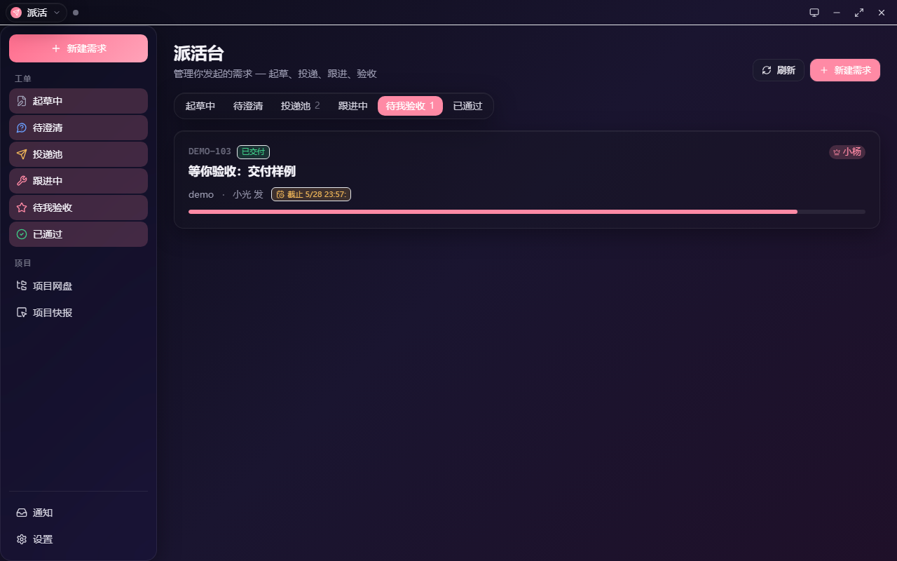
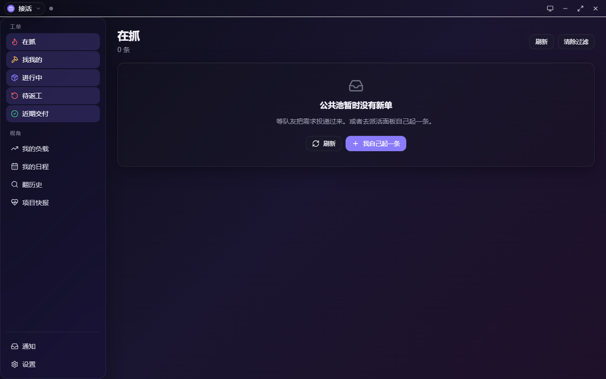
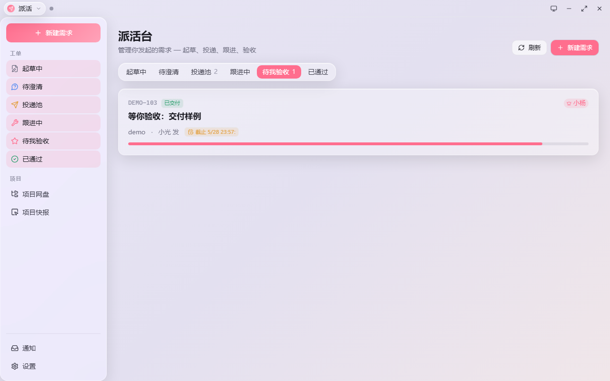
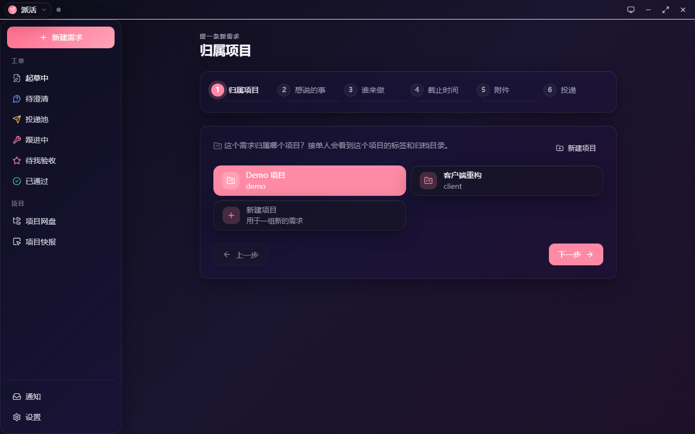
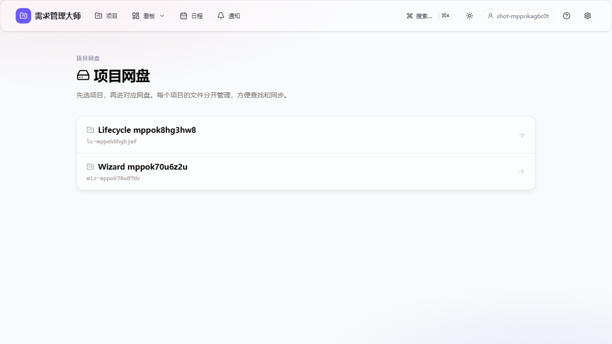
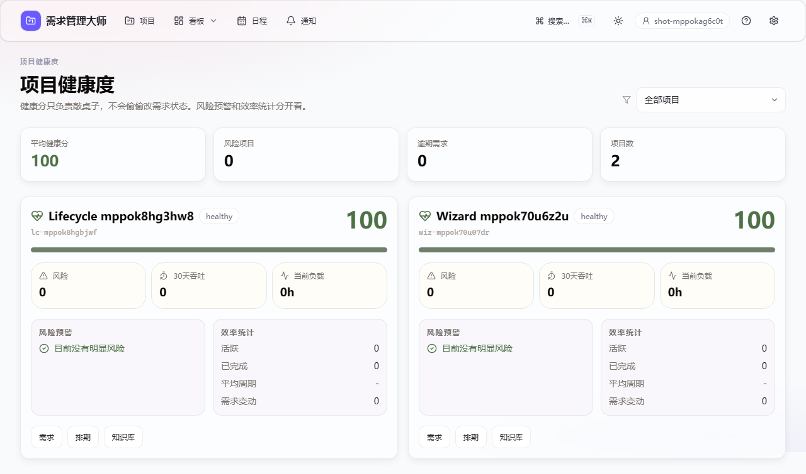

# 需求管理大师 · yqgl

> 内网团队用的 AI 原生工作中台。派活的人把想法扔进来，AI 负责追问和整理；接活的人在本地工作台接单、同步文件、更新进度、交付；项目过程里的会议、网盘、知识库、排期、健康度和通知都留痕。



[功能](#功能) · [双端职责](#双端职责) · [快速开始](#快速开始) · [开发与测试](#开发与测试) · [部署](#部署)

---

## 功能

### 双端工作台

- **Web 端**：派活、澄清、指定接单人、看排期/健康/知识库、验收和返工。
- **本地端**：既能派活，也能接活；拥有本地文件、系统托盘、系统通知、项目同步和交付能力。
- **同一个人可同时是派活人和接活人**，不引入复杂 RBAC；本地接活能力通过 client device token 校验。

### 需求流程

1. 新建项目。
2. 提一条新需求：描述、负责人/协作者、DDL、附件。
3. AI 澄清并生成结构化摘要。
4. 投递到公开池或指定接单方。
5. 本地端接活、拆解任务、更新个人工作区、交付。
6. 派活人验收或打回。

### 项目网盘

- 项目级文件夹、列表/卡片视图、拖拽上传、预览、下载、批量操作。
- PDF、Markdown、文本、代码、HTML、Office 文档文本预览。
- 软删除、回收站、撤回。
- 文件夹留言板：留言先经 LLM 判断，普通留言入板，需求变更会生成草稿并走澄清流程。
- 知识库会即时索引网盘解析文本，便于 grep 搜索。

### 会议纪要

- 上传会议录音或文本。
- 后台 ASR/LLM 任务有进度。
- 自动生成纪要和新增/变更需求洞察。
- 洞察需要人工确认，确认后生成需求草稿，不直接改原需求。

### 知识库与 grep Agent

- 不使用 embedding，不接向量库。
- 后端把需求、会议、留言、工作区、网盘解析文本、交付文档生成 Markdown 语料。
- 搜索和问答只基于受控 grep 结果；没有证据时明确说没找到。

### 排期、通知与健康度

- 资源排期按接单人、DDL、估算工时、阻塞、空闲/忙碌状态计算负载。
- 通知中心保留未读/已读；本地端对关键事项弹系统通知。
- 项目健康度聚合逾期、阻塞、无人接单、返工率、变更数、吞吐和平均周期。

### 项目归档与删除

- 项目可归档、恢复、软删除。
- 归档/删除/恢复都需要二次确认项目名。
- 删除不物理清理需求、网盘、会议和交付文件，先保护真人测试数据。

---

## 双端职责

| 入口 | 主要用途 | 能不能接活/交付 |
|---|---|---|
| Web `http://192.168.5.53:8080/` | 派活、管理、验收、查看全局态势 | 不能 |
| 本地工作台 | 派活 + 接活 + 文件同步 + 系统通知 + 交付 | 能 |

提需求页面是项目级路径：先进入某个项目，再点 **提一条新需求**；URL 形如 `/p/{project_id}/new`。

---

## 快速开始

### 团队成员

Web 端：

[http://192.168.5.53:8080/](http://192.168.5.53:8080/)

Windows 本地端一行安装：

```powershell
powershell -ExecutionPolicy Bypass -c "iwr -UseBasicParsing http://192.168.5.53:8080/client/install.ps1 | iex"
```

Linux/macOS 辅助脚本：

```bash
curl -fsSL http://192.168.5.53:8080/client/install.sh | bash
```

安装后会生成启动脚本、桌面快捷方式 `YQGL Workbench` 和开机启动项。右下角看不到图标时，先展开系统托盘隐藏区，别急着骂电脑。

### 本地端设置

- 服务端地址默认 `http://192.168.5.53:8080`，可在设置里改。
- 可设置项目保存位置、网盘同步目录、同步模式。
- 接单状态支持空闲、忙碌、自定义。
- DDL 提醒提前量可配置。

---

## 开发与测试

### 开发启动

```powershell
# 后端
python -m uvicorn main:app --app-dir app --reload --host 127.0.0.1 --port 8080

# Web
npm run dev --workspace=web

# 本地端前端
npm run dev --workspace=client-tauri -- --host 127.0.0.1 --port 5174
```

Tauri Rust 壳需要本机安装 Rust/Cargo；当前仓库的纯前端部分可以单独 build 和 E2E。

### 推荐验证命令

```powershell
python -m compileall app client scripts asr_service tts_service
python scripts\smoke_workflow.py
npm run build
npm run build --workspace=client-tauri
npx tsc --noEmit -p client-tauri\web-src\tsconfig.json
powershell -NoProfile -ExecutionPolicy Bypass -File scripts\smoke_client_install.ps1
```

Web E2E：

```powershell
$env:YQGL_E2E_API_PORT='19180'
$env:YQGL_E2E_WEB_PORT='16273'
npm run e2e:web
```

客户端 E2E 截图流：

```powershell
npm run dev --workspace=client-tauri -- --host 127.0.0.1 --port 5174
$env:YQGL_CLIENT_E2E='1'
$env:YQGL_USE_REMOTE='1'
cd web
npx playwright test tests/e2e/client-routes.spec.ts tests/e2e/client-spaces.spec.ts --reporter=list
```

当前本机验证记录：

- `python -m compileall app client scripts asr_service tts_service` 通过。
- `python scripts\smoke_workflow.py` 通过。
- `npm run build` 通过。
- `npm run build --workspace=client-tauri` 通过。
- `npx tsc --noEmit -p client-tauri\web-src\tsconfig.json` 通过。
- `npm run e2e:web`：23 passed，2 skipped，覆盖桌面、移动端和超宽屏截图巡检。
- 客户端 E2E：2 passed。
- PowerShell 管道安装 smoke 通过（本地模拟 `iwr ... | iex`，并验证桌面快捷方式/开机启动项）。
- Git Bash 语法检查 `client/install-client.sh`、`client/launch.sh` 通过。
- 本机没有 `cargo`，因此未运行 `cargo check`。

---

## 部署

目标服务器：

```text
http://192.168.5.53:8080
```

常用流程：

```powershell
npm run build
python scripts\deploy.py
python scripts\deploy_web.py
python scripts\restart_all.py
python scripts\verify_systemd.py
curl http://192.168.5.53:8080/api/health
```

首次部署或 `.env` 变化时：

```powershell
python scripts\deploy.py --env
```

后端依赖来自 `app/pyproject.toml`，不要再找 `requirements.txt`。ASR/TTS 是独立 systemd 服务，部署后应确认：

- `yqgl-web` active + enabled
- `yqgl-asr` active + enabled
- `yqgl-tts` active + enabled

---

## 仓库结构

```text
app/                  FastAPI 后端、SQLAlchemy 模型、路由和服务
web/                  浏览器派活/管理端
client-tauri/         Tauri 本地工作台
client/               跨平台辅助安装/启动脚本和旧托盘兼容脚本
shared/               Web 与本地端共享 UI、hook、设计 token、类型
scripts/              部署、远端验证、smoke、安装测试脚本
systemd/              yqgl-web / yqgl-asr / yqgl-tts 服务文件
screenshots/          README 与视觉回归截图
```

---

## 截图

### 接活 Space



### 派活 Space



### 新建需求



### 网盘



### 健康度



---

## License

MIT — see [LICENSE](LICENSE).
