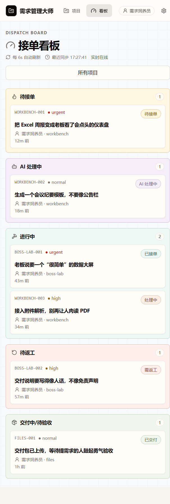
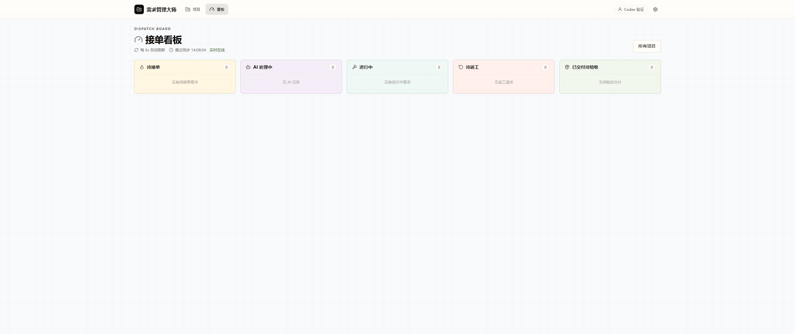
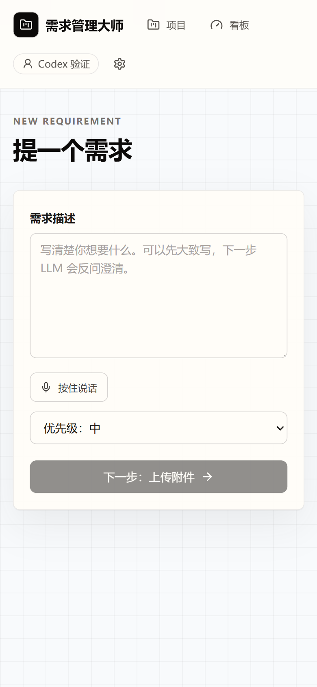
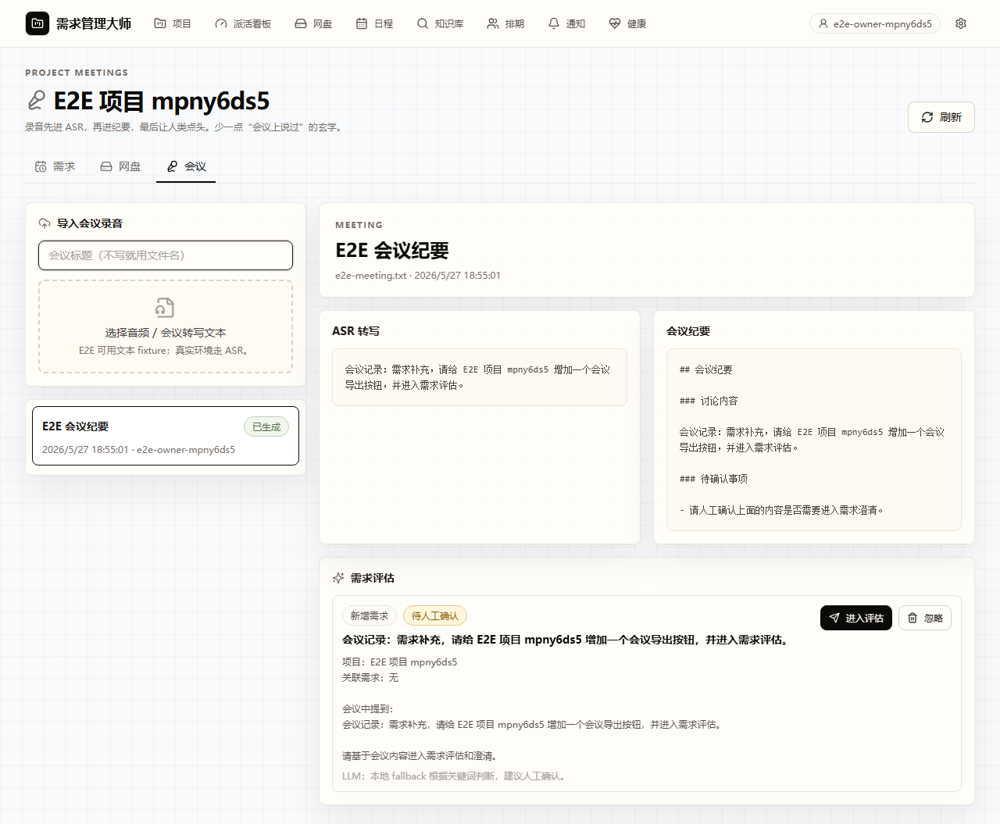
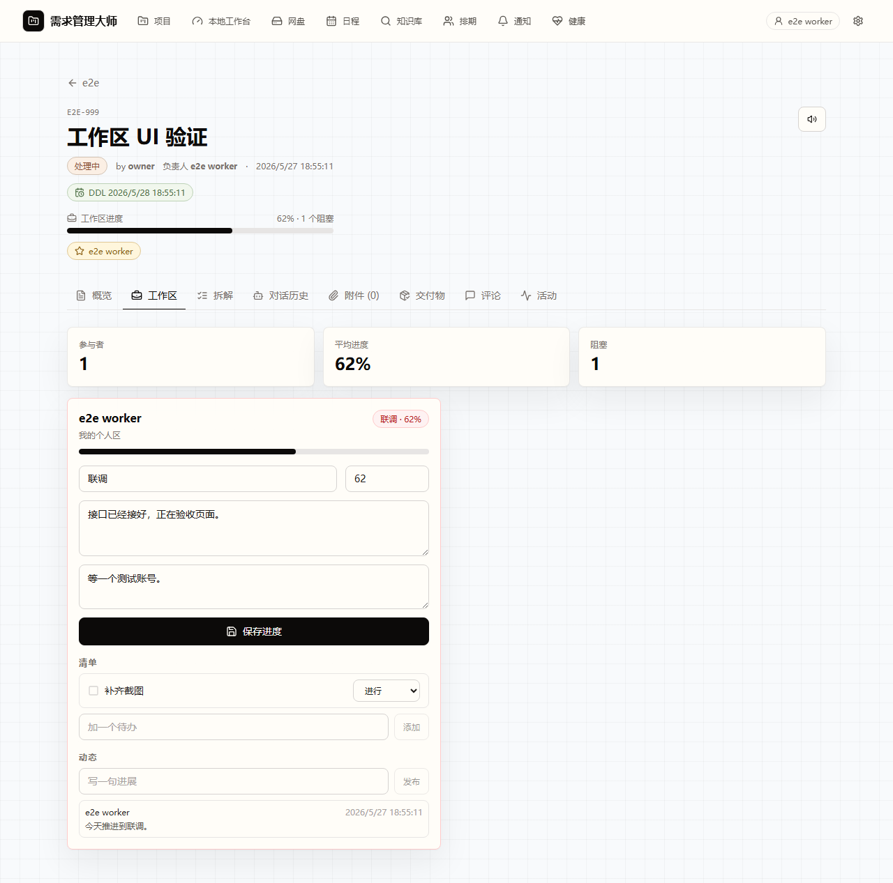
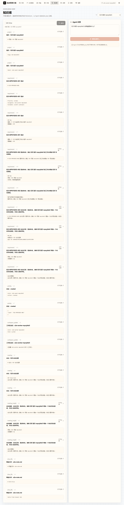
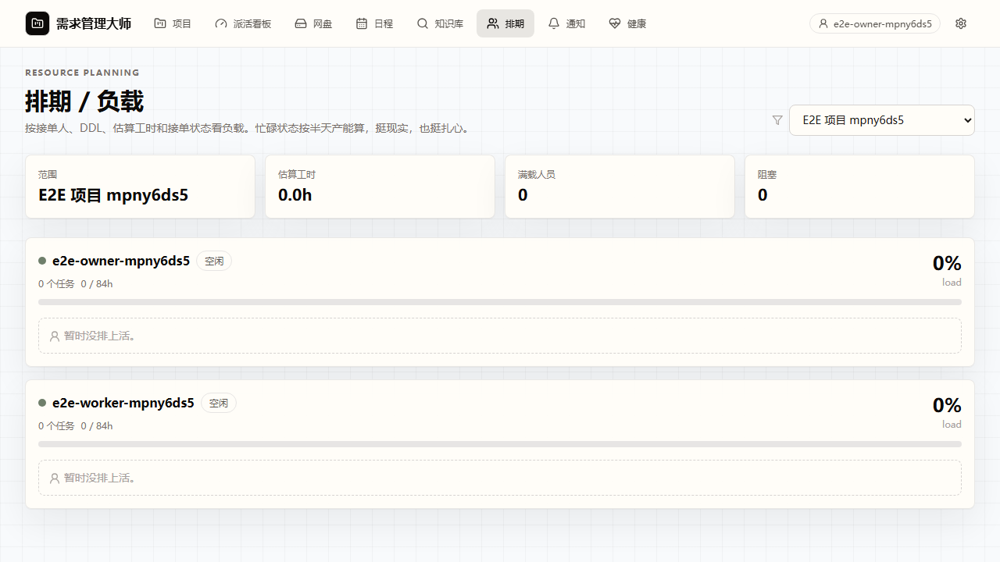
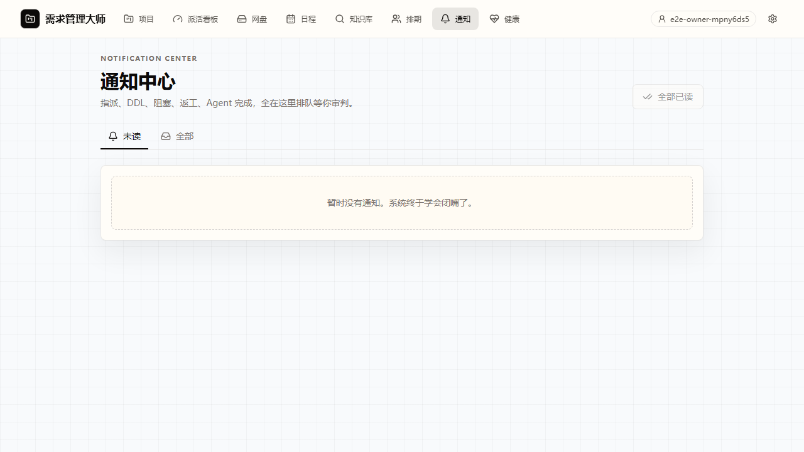
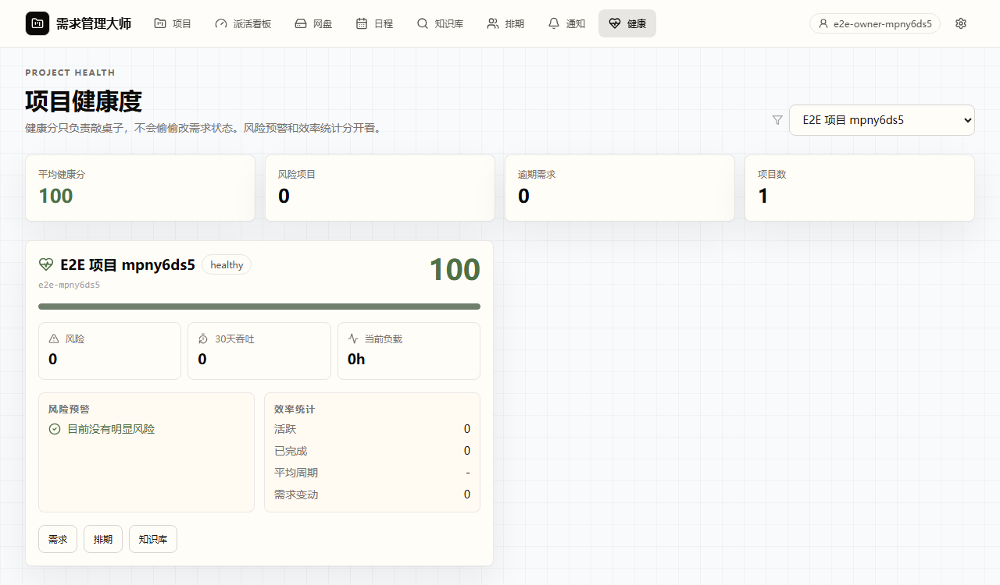

# 需求管理大师 · yqgl

> - 是不是想打死提需求的同事？
> - 是不是被产品经理一句"你看着办"气到吐血？
> - 是不是被老板"我有个想法很简单你随便弄一下"折磨到怀疑人生？
> - 是不是接到需求三天后才发现关键信息根本没说？
> - 是不是交付完客户才说"哦这不是我要的"？
>
> **来，把这堆人扔给 AI。** Web 端负责派活，本地端负责接活，谁也别再假装自己没看见。

[English](#english-summary) · [架构](#架构) · [快速开始](#快速开始) · [真人测试](#真人测试) · [路线图](#路线图)


---

## 它到底是什么

一个 **AI 原生** 的内网工作中台，把"项目 → 需求 → 接单方 → 个人工作区 → 交付验收"这条让所有打工人头大的链条**全自动化处理人的部分**：

```
   同事写一句模糊需求
        ↓
   LLM 反问澄清 (点选 + Other + 语音都行)
        ↓
   结构化需求文档 + 复杂度评估 + 任务拆解
        ↓
   ┌─ Web 派活端 → 提需求、指定人、看排期、验收、返工
   │
   └─ 本地工作台 → 接活、处理、维护工作区、同步文件、一键交付
```

### 端的分工

- **Web 浏览器端 = 派活/验收/管理端**：提需求、AI 澄清、指定负责人/协作者、看项目网盘/会议/日程/排期/健康/知识库、验收交付、申请返工。浏览器里不再接单、不开始处理、不编辑个人工作区、不上传交付。
- **本地客户端 = 工作台**：Python 托盘常驻 + pywebview 本地窗口，同一个用户既能派活也能接活；接单、推进状态、个人工作区编辑、任务交付、需求文件同步都在这里做。
- **服务端强校验**：worker API 必须带本地端设备 token。按钮藏起来只是礼貌，403 才是规矩。

## 它解决你哪些痛

| 你的痛 | 这玩意儿干了啥 |
|---|---|
| "需求像谜语，不澄清不知道做啥" | **LLM Agent 反问澄清**——选项式问答 + Other 自由补充 + 语音回答，问到 AI 自己觉得够了为止 |
| "拿到需求就 3 行字，附件还是图片" | 上传 PDF/Word/Excel/PPT 都解析成文本，对话历史 + 原始文件 + 摘要一起打包推过来 |
| "想指定谁干，别又公开喊麦" | 提需求时可指定负责人 + 多个协作者，还能看到谁在线，活人优先，别把锅甩给离线传说 |
| "不知道谁现在有空，问一圈像钓鱼" | 在线列表升级成 **在线 + 空闲/忙碌/自定义状态**，接单人自己在客户端或网页设置状态 |
| "DDL 没写，需求就开始永生" | 提需求必须选 DDL；日程表统一看预约和需求截止时间，客户端会提醒快到期/已逾期 |
| "任务一长就没人知道进展" | 系统后台任务有进度条；每个接单人还有自己的工作区：阶段、百分比、清单、阻塞原因、动态都能看 |
| "项目事实散得像开盲盒，搜不到就全靠记忆力" | **项目级知识库** 把需求、会议、网盘解析文本、交付、工作区动态写成 Markdown；不搞 embedding，Agent 只能 grep 证据回答 |
| "谁忙谁闲全靠感觉，排期像玄学占卜" | **资源排期 / 负载视图** 按人、DDL、估算工时、阻塞和空闲/忙碌状态算负载，忙碌人员自动半产能 |
| "一个需求到底怎么拆、怎么验收，每个人理解不同" | **两阶段 Agent 拆解**：投递前给任务/风险/验收标准，接单后给个人执行清单；人工确认才写入需求或工作区 |
| "消息散在各处，等发现已经逾期" | **通知中心** 持久保存指派、DDL、阻塞、返工、拆解完成、知识库问答等提醒；托盘客户端也轮询关键通知 |
| "项目到底健康不健康，开会前才开始翻" | **项目健康仪表盘** 给健康分、风险原因和效率指标，不改状态，只负责在旁边敲桌子 |
| "会议录音里冒出新需求，最后变成微信群悬案" | 导入会议录音后自动 ASR 转写、LLM 生成纪要，并把新增/变更需求抽出来，人工确认后进入澄清流程 |
| "项目资料散在群里，翻到手抽筋" | **项目网盘**：文件夹树 / 列表 / 平铺、拖拽上传、在线预览、批量操作、复制剪切粘贴、回收站撤回 |
| "本地项目文件和网盘谁新谁旧看命" | 客户端可选项目网盘自动同步：关闭 / 单向下载 / 双向同步，本地删除默认不动远端，先保命 |
| "在项目文件夹留言，结果变成群聊考古" | 文件夹留言先过 LLM；普通留言入板，像需求变动的自动生成需求草稿继续澄清 |
| "简单的需求也排队几天" | LLM 自评 `ai_doable`，纯文件小活交给 AI agent 先试试（附件进 `inputs/`，成果出 `outputs/`，还能跑受控命令自检），失败自动转人工 |
| "交付完了客户问'怎么用'" | 你打包上传后，LLM 自动读所有交付文件写**面向客户的交付文档**（含原需求映射表 + 已知局限） |
| "不知道现在多少单要处理" | 本地工作台 / 派活看板自动刷新，按状态分卡片，新需求弹系统通知 |
| "草稿还没想清楚就被围观" | 草稿 / 澄清 / 待确认投递阶段默认仅提交人可见；投递后才进公共看板。先把裤子穿上，再开会。 |

## 功能

- 📝 **澄清式 Agent**：DeepSeek 流式 thinking + 三种动作（ask_choice / ask_open / summarize）
- 🎙️ **语音输入**：浏览器按住录音 → Qwen3-ASR 转写到输入框
- 🔊 **语音输出**：CosyVoice 3 个音色，可设置 AI 消息自动朗读
- 📦 **附件理解**：上传 PDF/Word/Excel/PPT/图片，markitdown 解析后喂给 LLM
- 🤖 **AI 自动处理**：summarize 判定 `ai_doable=true` → Anthropic SDK tool_use 自建 agent（附件预载到 `inputs/`，交付固定写 `outputs/`，可跑受控命令自检）→ 适合静态页面、脚本模板、文档、轻量数据处理这类“小活先让 AI 试试”
- ✅ **确认投递**：AI 汇总后先停在 `summary_ready`，提交人确认后才进入 `ready`；不再把半熟需求直接扔进同事工位
- 👥 **多人接单**：负责人 + 协作者模式；提需求时能搜索成员、看在线状态、指定多人，投递后全员可见但只有指定人能处理和交付
- 🖥️ **Web 派活端 / 本地工作台**：浏览器只负责派活、管理和验收；本地 pywebview 工作台既能派活也能接活，接单/处理/交付必须走本地端能力 token
- 🟢 **接单状态**：客户端 / Web 可设置空闲、忙碌、自定义状态；选接单人时在线空闲优先，不用靠玄学猜谁在摸键盘
- 📅 **日程与 DDL**：提需求强制 DDL；新增日程表，需求截止时间自动入日程，客户端按 24h / 2h / 到期 / 逾期提醒
- 📈 **长任务进度**：ASR、会议纪要、Auto Agent 这类后台长任务都有 `background_jobs` 进度；前端能轮询，SSE 也会广播更新
- 🧭 **个人工作区**：需求详情按“项目 → 需求 → 接单方 → 个人工作区”重组；负责人/协作者自动拥有工作区，可维护阶段、进度、阻塞、清单和动态
- 🔎 **项目级知识库**：项目信息、需求、对话、评论、活动、工作区、会议、网盘解析文本、交付文档全部增量生成可 grep 的 Markdown 语料；`/knowledge` 可全局搜，也能限定项目搜
- 🧠 **Grep Agent 问答**：不走 embedding，不接向量库；Agent 只有 `grep_corpus` / `open_knowledge_doc` 这类只读能力，必须给证据链接，没证据就乖乖认怂
- 🧮 **资源排期 / 负载**：需求支持估算工时、估算信心和计划备注；`/planning` 按接单人统计任务数、估算工时、容量、逾期、阻塞和本周 DDL
- 🧩 **两阶段任务拆解**：`dispatch` 阶段产出任务、风险、验收标准和建议工时；`worker` 阶段产出个人执行清单。确认后才写入验收区或个人工作区
- 🔔 **通知中心**：Web 持久通知 + 未读 / 全部视图 + 一键已读；托盘客户端轮询高优先级通知，避免大家错过“锅已经到你桌上了”
- ❤️ **项目健康度**：全局和项目级健康页展示健康分、风险清单、逾期/阻塞/无人接单/即将到期/返工/变更/吞吐/平均周期/当前负载
- 🧾 **会议纪要**：项目页支持导入会议录音/文本，ASR 转写后由 LLM 生成纪要，并识别新增需求或变更需求，确认后生成草稿继续澄清
- 🗄️ **项目网盘**：项目级文件管理器，支持文件夹树 / 列表 / 平铺视图、版本替换、批量下载、软删除回收站、PDF/MD/HTML/代码/Office 文本预览
- 🔁 **项目文件同步**：托盘客户端可把项目网盘同步到本地；默认关闭，支持单向下载和双向同步，本地删除默认不传播，避免手滑变事故
- 💬 **文件夹留言板**：每个网盘文件夹都有留言；LLM 自动判断“普通留言”还是“需求变动”，后者直接生成需求草稿走澄清流程
- 🔐 **权限防串单**：草稿隐私、附件/交付包访问控制、分片上传归属校验、同步 ACK 权限校验、本地端 worker capability 校验。它不是银行系统，但也不该像公共留言板
- 🧯 **防重复点击**：澄清 SSE 并发锁、投递/接单/开始处理 busy 态，专治“我点了三下怎么出了三份需求”
- 🗂️ **项目管理**：从 draft 到 accepted 的完整状态机，Kanban 风格 dashboard，评论 / 活动时间轴
- 🔔 **本地托盘 / 工作台**：Python pystray 常驻，SSE 长连接 + 系统通知，pywebview 打开 `/local-workbench`，文件同步到本地目录
- 🔄 **完整交付闭环**：本地做完 → 一键打包上传 → LLM 写交付文档 → 提需求方接受 / 申请返工

## 截图

新鲜截图，刚从浏览器 E2E 现场逮回来的，不是设计稿，不是“仅供参考”，也不是老板画在白板上的精神胜利。

| 主页项目列表 | 派活看板 / 本地工作台 |
|---|---|
|  |  |

| AI 澄清对话 | 最终汇总（含 AI 复杂度判断） |
|---|---|
|  |  |

| 移动端看板 | 超宽屏看板 |
|---|---|
|  |  |

| 移动端提需求 |
|---|
|  |

| 会议纪要（录音/文本导入后自动抽需求） | 个人工作区（进度、阻塞、清单、动态） |
|---|---|
|  |  |

| grep 知识库（证据回答，不许胡说） | 排期负载（谁满谁闲别再靠猜） |
|---|---|
|  |  |

| 通知中心（锅来了会敲门） | 项目健康度（风险和效率一起看） |
|---|---|
|  |  |

## 架构

```
┌──────────── 服务器 (Ubuntu + GPU) ────────────┐
│  yqgl-web :8080     FastAPI + SPA + SSE        │
│      ├─ LLM clarify (DeepSeek streaming)       │
│      ├─ background_jobs (ASR / meetings / AI)  │
│      ├─ knowledge_corpus (Markdown + grep)     │
│      ├─ workload / notifications / health      │
│      ├─ personal workspaces + progress         │
│      ├─ task decomposition (confirm-to-apply)  │
│      ├─ Auto-process agent (tool_use)          │
│      ├─ meeting minutes + insight routing      │
│      └─ LLM 写交付文档                          │
│                                                 │
│  yqgl-asr :8001     Qwen3-ASR-1.7B 常驻显存    │
│  yqgl-tts :8002     CosyVoice3 0.5B 常驻显存   │
│                                                 │
│  SQLite + 文件存储 + 三个 systemd unit         │
└────────────────────┬───────────────────────────┘
                     │ HTTP/SSE 局域网
       ┌─────────────┴─────────────┐
       ▼                           ▼
┌──────────────┐         ┌────────────────────────────┐
│ 浏览器 SPA    │         │ 本地客户端 (Win/Linux/macOS) │
│ React + Vite │         │ Python pystray + httpx SSE │
│ Tailwind     │         │ 网盘同步 + DDL 提醒          │
│ 派活/验收/管理 │         │ pywebview /local-workbench  │
└──────────────┘         └────────────────────────────┘
   Web 只派活               本地可派可接 + worker token
```

## 技术栈

| 层 | 用什么 |
|---|---|
| 后端 | Python 3.12 · FastAPI · SQLAlchemy 2.0 · SQLite · httpx · anthropic SDK |
| 前端 | Vite · React 18 · TypeScript · Tailwind · react-router |
| ASR | Qwen3-ASR-1.7B · torch+CUDA · qwen_asr Python API |
| TTS | CosyVoice 3 0.5B · 3 zero-shot 音色 |
| LLM | DeepSeek (Anthropic 兼容端点)，支持 thinking blocks + tool_use |
| 客户端 | Python · pystray · pywebview · plyer · Pillow |
| E2E | Playwright · Chromium |
| 部署 | systemd · uv (Python 版本) · pip 清华源 |
| 文件解析 | markitdown (微软出品，覆盖 PDF/Word/Excel/PPT/HTML/...) |

## 快速开始

### 服务器（Linux + NVIDIA GPU）

```bash
# 1. 准备
git clone https://github.com/mycyg/requirement-master.git yqgl
cd yqgl
cp scripts/server_creds.example.py scripts/server_creds.py   # 填 SSH 凭据
cp app/.env.example app/.env                                  # 填 DeepSeek LLM key 等

# 2. 主 web 服务（FastAPI + SQLite + systemd）
#    装到 /srv/yqgl/{app,venv,data}/，建主 systemd unit，开机自启
python scripts/provision.py

# 3. ASR + TTS 服务（GPU；首次共约 7GB 模型下载 + 5GB torch wheel）
python scripts/setup_py313.py           # 装独立 Python 3.13 (uv，~30MB)
python scripts/download_models.py       # 下 Qwen3-ASR-1.7B + CosyVoice repo + 0.5B 模型 (~7GB)
python scripts/install_cosy_deps.py     # 装 torch + qwen-asr + cosyvoice 所有 deps (~5GB torch)
python scripts/provision_asr.py         # 模板化 yqgl-asr.service + 启动 (8001)
python scripts/provision_tts.py         # 模板化 yqgl-tts.service + 启动 (8002)

# 4. 前端构建 + 部署
cd web && npm install && npm run build && cd ..
python scripts/deploy_web.py

# 5. 校验
python scripts/verify_systemd.py        # 三个 unit 都应 enabled + active
curl http://your.server.ip:8080/api/health
```

> **不需要 ASR/TTS？** 跳过步骤 3 即可。主 web 服务和 LLM 澄清不依赖它们；只是语音输入 / 输出会返回 503。

详细步骤、运维命令、风险见 [DEPLOY.md](DEPLOY.md)。

### Web 派活端（浏览器）

打开 `http://192.168.5.53:8080`（或你的 `192.168.5.x` 服务器地址），填昵称即可用。这里负责提需求、澄清、指定接单人、看进度、验收/返工；接单、处理、交付请去本地工作台，浏览器硬拼 worker API 会被 `403 local client required` 拍回来。

### 本地工作台（Windows / Linux / macOS 客户端）

内网偷懒一行装：

```bash
# Windows PowerShell
powershell -ExecutionPolicy Bypass -c "iwr http://192.168.5.53:8080/client/install.ps1 | iex"

# Linux / macOS
curl -fsSL http://192.168.5.53:8080/client/install.sh | bash
```

本地源码方式：

```bash
cd client
pip install -r requirements.txt
python yqgl_tray.py    # 首次启动有配置向导
# Windows 启动脚本：launch.bat 或 launch.ps1
# Linux/macOS 启动脚本：./launch.sh
# Windows 也可打成 .exe：build_exe.bat
```

默认服务端 IP 是 `192.168.5.53`，端口 `8080`。首次启动和托盘「设置…」里都可以自己改服务端 IP、项目保存位置、项目网盘同步目录、接单状态、DDL 提醒提前量和设备名；保存后客户端会注册本地端能力 token，配置写到 `%APPDATA%\yqgl\config.json`（Windows）或 `~/.config/yqgl/config.json`（Linux/macOS）。如果旧配置里还写着 `192.168.0.x`，托盘启动时会自动迁到同尾号的 `192.168.5.x`，避免接单方连去隔壁宇宙。

托盘菜单第一项 "打开本地工作台"（默认双击）会启动 pywebview 并打开 `/local-workbench`，自动带昵称 cookie 和本地端 token；"打开 Web 派活端" 会进普通浏览器管理端；"打开项目保存位置" 会直接打开本地需求文件根目录。项目网盘同步默认关闭，可切到单向下载或双向同步；本地删除默认不会删远端，手滑党暂时安全。

## 真人测试

团队成员今天就能开始试，入口别找错：

- 派活/验收/管理：浏览器打开 `http://192.168.5.53:8080`
- 本地接活/处理/交付：先装客户端，再从托盘点 **打开本地工作台**
- Windows 一句话安装：`powershell -ExecutionPolicy Bypass -c "iwr http://192.168.5.53:8080/client/install.ps1 | iex"`
- Linux/macOS 一句话安装：`curl -fsSL http://192.168.5.53:8080/client/install.sh | bash`

建议第一轮真人测试按这条链路走，别一上来就挑战地狱副本：

1. 浏览器端填昵称，新建项目。
2. 提一个带 DDL 的需求，指定一个在线空闲接单人。
3. 接单人在客户端设置昵称和设备名，打开本地工作台。
4. 本地工作台里接单、开始处理、改个人工作区进度、加清单、写动态。
5. 浏览器端只读查看接单方进度，确认 Web 端没有“接单/开始处理/上传交付”这类按钮。
6. 本地端上传交付包，浏览器端验收或返工。
7. 顺手测项目网盘上传/预览、会议导入、日程、通知、知识库 grep、排期和健康页。

如果浏览器里手动调接单/交付接口看到 `403 local client required`，那不是坏了，是它终于学会了看门。

### 远端持久化

当前生产服务跑在 `192.168.5.53:8080`，三个 systemd unit 都应保持开机自启：

```bash
systemctl is-enabled yqgl-web yqgl-asr yqgl-tts
systemctl is-active yqgl-web yqgl-asr yqgl-tts
curl http://192.168.5.53:8080/api/health
```

本次发布已确认 `yqgl-web`、`yqgl-asr`、`yqgl-tts` 均为 `enabled + active`。如果机器重启，systemd 会自动拉起；如果哪天它没起来，先看 `journalctl -u yqgl-web -n 100 --no-pager`，别先怪同事。

### 端到端冒烟测试

```bash
# 本地快速核心流，不依赖 LLM / ASR / TTS。适合提交前先摸一下脉搏。
python scripts/smoke_workflow.py

# 下面这些打真实服务，跑起来更像真的上班。
export YQGL_BASE=http://your.server.ip:8080
export DEEPSEEK_API_KEY=sk-...
python scripts/smoke_m3.py     # 项目+需求+上传+解析
python scripts/smoke_m4.py     # LLM 澄清
python scripts/smoke_m6.py     # submit + push
python scripts/smoke_m8.py     # 人工 delivery + LLM 文档
python scripts/smoke_m12.py    # AI 自动处理（受限文件工具，不执行 shell）
```

### 浏览器 E2E

```bash
cd web
npm install
npx playwright install chromium
npm run e2e
```

这条会自动起一个临时 FastAPI + Vite 测试环境，默认用 `127.0.0.1:18080` 和 `127.0.0.1:15173`，数据落到 `.e2e/` 临时目录，不碰正式库。端口撞车时可以自己挪：

```bash
# Bash / zsh
YQGL_E2E_API_PORT=18081 YQGL_E2E_WEB_PORT=15174 npm run e2e

# Windows PowerShell
$env:YQGL_E2E_API_PORT=18081; $env:YQGL_E2E_WEB_PORT=15174; npm run e2e
```

当前浏览器 E2E 覆盖：昵称登录、在线接单人 + 空闲状态展示、DDL 必填、指定负责人、日程创建、项目网盘上传与 Markdown 预览、文件夹留言转需求草稿、会议导入 → 纪要 → insight 确认 → 需求草稿、知识库 grep 搜索 + Agent 证据回答、排期负载页、通知中心、项目健康页、Web 派活看板、本地 runtime mock 下的个人工作区编辑入口、语音输入 mock、设置弹窗 TTS 服务异常友好提示。2026-05-27 本机已跑通：Chromium `2 passed`，这回不是“脑内测试通过”，是真的让浏览器上班了。

## ASR / TTS 一些坑（社区参考）

| 组件 | 关键事 |
|---|---|
| Python 版本 | 必须 **3.13**（CosyVoice + qwen_asr 的轮子和老版 transformer 链卡死在 3.13） |
| Python 装哪儿 | 用 `uv python install 3.13`，**别动系统 python**（PEP 668 会拦你） |
| 包装哪儿 | `pip install --user --break-system-packages` 到 `~/.local/lib/python3.13/site-packages`；systemd unit 通过 `PYTHONUSERBASE=$HOME/.local` 让服务进程找得到 |
| Qwen3-ASR 调用方式 | **不用 vLLM**；用 `qwen_asr.Qwen3ASRModel.from_pretrained()` Python API。模型 2.6s 加载、转 28s 中文 wav 约 2.8s |
| CosyVoice 依赖坑 | `inflect` / `rich` / `WeTextProcessing` / `pynini` 容易缺。`install_cosy_deps.py` 末尾的迭代探测 loop 会自动补齐 |
| 模型路径 | 都在 `~/CosyVoice/pretrained_models/Fun-CosyVoice3-0.5B` 和 `~/.cache/modelscope/hub/...`；systemd unit 通过 `{{HOME}}` 占位符动态生成 |
| GPU 显存 | ASR ~5GB + TTS ~3GB + 操作系统/X11 ~200MB，单卡 RTX 3090 (24GB) 富余很多 |

## 路线图

- [x] **v0.1** —— M0~M13 全部完成，端到端跑通
- [ ] 拖拽 Kanban (dnd-kit)
- [x] 日程表 + 需求 DDL + 客户端提醒
- [x] 多接单人路由 / 任务分发 / 在线接单人提示
- [x] 接单人空闲 / 忙碌 / 自定义状态
- [x] 项目网盘自动同步（单向 / 双向可选）
- [x] 项目文件夹留言板 + LLM 需求草稿分流
- [x] 长任务进度（ASR / 会议 / Agent 后台任务）
- [x] 个人工作区（接单人阶段、进度、清单、阻塞、动态）
- [x] 会议录音导入 → ASR → 纪要 → 新增/变更需求确认
- [x] 项目级知识库 + 全局 grep 搜索 Agent（无 embedding，无向量库）
- [x] 资源排期 / 负载视图
- [x] 两阶段 Agent 任务拆解（投递前 / 接单后，人工确认落库）
- [x] 通知中心 + 托盘关键通知轮询
- [x] 项目健康度仪表盘（风险预警 + 效率统计）
- [x] 本地端工作台重构（Web 只派活，本地可派可接，worker API 强制本地 token）
- [ ] 用户密码 + RBAC（当前只内网无密码）
- [ ] 企业微信 / 钉钉 / 飞书机器人推送
- [x] 跨平台客户端启动脚本（Windows / Linux / macOS）
- [ ] 更像正经日程工具的甘特图 (frappe-gantt)
- [ ] 需求模板库

## 致谢

- [Qwen3-ASR](https://huggingface.co/Qwen/Qwen3-ASR-1.7B) · 阿里通义实验室
- [CosyVoice](https://github.com/FunAudioLLM/CosyVoice) · 通义语音
- [DeepSeek](https://www.deepseek.com/) · 提供 Anthropic 兼容 LLM 端点（v4 pro / v4 flash）
- [markitdown](https://github.com/microsoft/markitdown) · 微软
- [Anthropic SDK](https://github.com/anthropics/anthropic-sdk-python)

## License

[MIT](LICENSE) — 随便用，但作者不对生产环境后果负责。

---

## English Summary

**yqgl** is an AI-native **intranet workbench** built for small teams:
- The browser app is the dispatch/review/admin side: create requirements, clarify, assign people, inspect progress, review deliveries, and request rework.
- The local Python client is the real workbench: the same user can dispatch and work, but claiming, worker progress, personal checklist edits, sync ACKs, and delivery uploads require a registered local-client token.
- Submitters describe what they need; an LLM agent asks clarifying questions (multiple choice + free text + voice).
- Structured markdown spec + original files + full chat history sync to the assignee's local folder.
- After summarization, the requester explicitly confirms dispatch before the requirement appears on the shared board.
- Requirements can be assigned to one lead and multiple collaborators, with online/free/busy/custom availability shown during dispatch.
- DDL is mandatory before dispatch; requirement deadlines automatically appear in the calendar and tray clients show due/overdue reminders.
- Long-running ASR, meeting-minutes, and Auto Agent jobs are tracked with first-class progress records and SSE updates.
- Each assignee gets a personal workspace under the requirement, with phase, progress percentage, notes, blocker reason, checklist items, and progress updates.
- Project meetings can be imported from recordings or text; ASR creates transcripts, the LLM writes minutes, and humans confirm whether detected new/change requirements become clarification drafts.
- Project Drive supports folders, versioned files, preview, comments, optional local sync, and LLM-routed folder comments that can become requirement drafts.
- Project knowledge is exported into grep-friendly Markdown corpus files; search and Q&A deliberately avoid embeddings/vector databases, and the agent must cite evidence links.
- Resource planning shows per-assignee workload, capacity, overdue/blocker counts, and DDL pressure.
- Two-stage task decomposition creates dispatch plans and worker checklists, but only after a human confirms the draft.
- Notification Center persists assignment, DDL, blocker, rework, decomposition, knowledge-answer, and agent-result events; tray clients poll high-priority notifications.
- Project Health ranks projects with risk warnings and efficiency metrics.
- An LLM judges complexity. If "low / AI-doable", an in-process Anthropic-tool_use worker can preload attachments, write deliverables under `outputs/`, and run controlled sandbox commands for simple validation. On failure, it falls back to human.
- Drafts, clarification conversations, attachments, deliveries, chunk uploads, sync acknowledgements, and worker-only actions now have workflow-aware permission checks, because "LAN-only" is not a personality trait.
- Voice in (Qwen3-ASR) and voice out (CosyVoice, 3 presets) wired throughout.
- After human delivery: zip → chunked upload → LLM auto-writes a customer-facing delivery doc with original-requirement mapping table.

All metadata lives in SQLite, files live in plain directories, and deployment targets a single Ubuntu box with GPU via systemd. The client is pure Python (pystray + pywebview + httpx), injects the local workbench runtime into React, and ships Windows/Linux/macOS launch scripts — no Rust/Electron needed.

Built end-to-end as a one-shot demo of "what's possible when you let the AI hold both ends of the requirement lifecycle".
