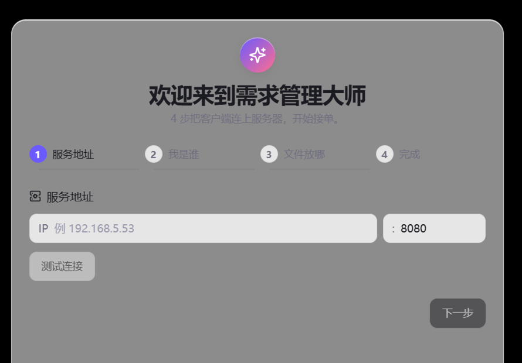
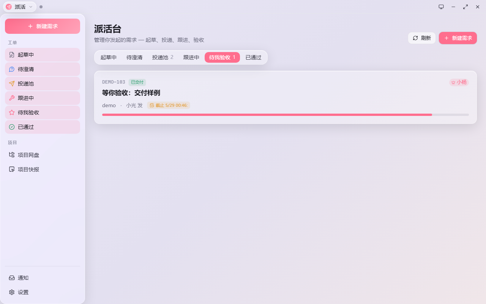
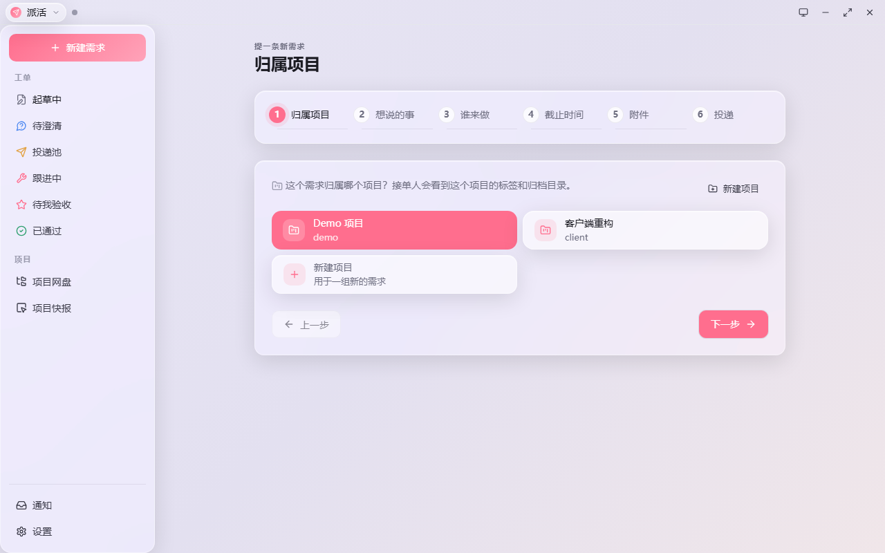
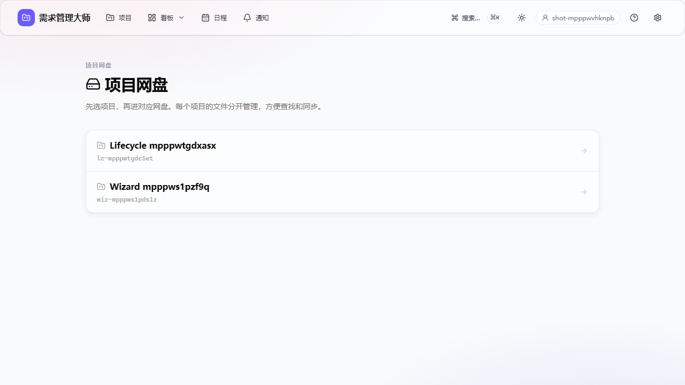
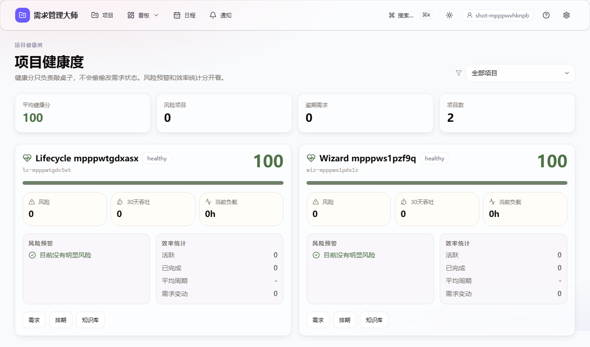

<div align="right"><a href="README.en.md">English</a> · <b>中文</b></div>

# 需求管理大师

**老板：「做个差不多的东西。」**
**你：「……差不多是多少？」**
**老板：「你懂我意思。」**
**你：（不懂，但已经在改了）**

这破循环，整个互联网公司都在跑。需求管理大师就是来掐断它的——一个**纯局域网**的需求中台，把「群里随口一说」变成**有状态、有 DDL、有负责人、能验收**的正经活儿。

不用注册、不用上云、不用对接十八个 SaaS。一台内网机器跑起来，全公司开干。



---

## 先问你几个灵魂问题

- 老板说「你看着办」，你看着看着把锅看到自己头上了？
- 需求在群里飘了三天，附件翻不到、DDL 没人记、最后问「这谁让做的」全员装死？
- 文件 `最终版_v2_真的最终版_这次真的.zip` 在聊天记录第 800 层？
- 会开完了热血沸腾，第二天没人记得当时拍板了啥？
- 领导问「项目还好吗」，你现搓一份周报糊弄过去？

中一条就该看下去了。

---

## 它到底怎么治

| 病 | 药 |
|---|---|
| 需求说不清 | AI 先替老板追问：谁用、何时要、验收标准、附件、负责人、DDL，问到能落地为止 |
| 需求记不住 | 每条需求有状态机、有 DDL、有负责人、有协作者、有个人工作区 |
| 文件到处飞 | 项目网盘统一收，能预览、能回收、能进知识库 |
| 会议白开 | 录音/文本自动出纪要，还自动揪出「新增需求 / 需求变更」 |
| 项目黑盒 | 健康度 + 排期 + 通知 + 知识库，一屏看穿，不用手搓周报 |

---

## 两个端，一个负责动嘴，一个负责动手

这玩意儿是**双端**的，分工很明确：

- **Web 派活台** = 指挥室。提需求、AI 澄清、点名接单人、看项目/排期/健康/知识库、验收、打回返工。**但浏览器里碰不了「接单」和「交付」。**
- **Rust 毛玻璃本地端** = 干活桌。派活能干、接活也能干，外加本地文件、托盘常驻、系统通知、网盘同步、打包交付。

为啥浏览器不让接单？因为接活/交付这种事得绑「这台设备是谁」——本地端带 client device token，服务端**硬校验**。想绕过 UI 直接打接口偷接单？后端只会回你俩字：**不准**。

---

## 上图，不上图都是耍流氓

**派活台 —— 谁发的、谁接的、谁验收、谁背锅，一屏看完**


**新建需求 —— 先把话说明白，再让人开干**


**项目网盘 —— 文件别再埋在聊天记录第 800 层**


**项目健康度 —— 哪条需求要炸了，别等老板拍桌才知道**


---

## 功能挨个说

**🤖 AI 澄清需求**
你扔一句「想搞个管理系统」，AI 不会立刻动手，而是反过来盘问你：谁用？啥时候要？验收标准是啥？附件呢？谁负责？DDL 哪天？盘清楚了出一份摘要，**提交人点头确认**才能投递。提示词内部用英文写，给你看的回复用你的语言；澄清过程是流式的，「思考中」气泡 + 最终结果，不卡在转圈圈。

**👥 多接单人**
一条需求 = 1 个负责人 + N 个协作者，每人有自己的工作区：当前阶段、进度百分比、阻塞原因、待办清单、动态流水。没点名接单人的，丢进公开池，本地端谁抢谁当负责人。

**⏰ DDL 与日程**
投递需求**必须**填 DDL，没得商量。DDL 自动同步到日程表，本地端按 24 小时 / 2 小时 / 到点 / 逾期四档提醒。再有人说「我以为下周五是下下周五」，系统都替你叹气。

**📁 项目网盘**
文件夹 / 列表 / 卡片三种视图；上传、下载、批量打包下载；PDF / Markdown / 文本 / 代码 / HTML / Office 都能预览；软删除、回收站、撤回一应俱全；还有文件夹留言板——留言会过一遍 LLM，闲聊就当留言，**一看是需求变更，直接给你生成需求草稿**。

**🎙️ 会议纪要**
丢进录音或文本 → 后台任务跑进度条 → ASR 转写 → LLM 写纪要 → LLM 判断有没有新增/变更需求 → **人工确认**后才进澄清流程。会议里抓到的 insight **绝不直接改原需求**，免得某位老哥会上一通激情输出，直接把生产状态给污染了。

**🔎 知识库（不搞向量库也能搜）**
本项目偏不走 embedding 那套。后端把项目、需求、会议、留言、工作区、网盘解析文本、交付文档全揉成 Markdown 语料；搜索和 Agent 问答基于**受控 grep**，答案**必须给证据**。搜不到就老老实实说搜不到，绝不跟你「我感觉应该是这样」。

**📊 排期 / 通知 / 健康度**
排期看每个人手上几个活、估了多少工时、逾期没、卡住没、负载多重；通知中心分未读/已读、点了能跳转，本地端关键事弹系统通知，Web 端实时弹 toast；健康度盯逾期、阻塞、无人接、返工率、变更数、吞吐量、平均周期。

---

## 五分钟跑起来

**Web 端**——内网直接开：

```text
http://192.168.5.53:8080/
```

提需求是项目级的，先进项目再点「新建需求」，地址长这样：

```text
http://192.168.5.53:8080/p/<项目ID>/new
```

**Windows 一行装**：

```powershell
powershell -ExecutionPolicy Bypass -c "iwr -UseBasicParsing http://192.168.5.53:8080/client/install.ps1 | iex"
```

装完给你：桌面快捷方式 `YQGL Workbench`、开机自启、本地配置、托盘常驻。
托盘里找不到图标？先点开右下角那个隐藏小箭头——它不是没上班，是 Windows 把它藏起来摸鱼了。

**macOS 原生包**——已经发布了，直接去 Web 顶部那条下载横幅点 **macOS 客户端** 就行。Windows 老哥点 Windows，Mac 老哥点 macOS，别再把 `.exe` 硬塞进 Mac 里念经了。

> macOS 包是 **Universal**（Apple Silicon + Intel 通吃），在 GitHub Actions 的 macOS runner 上交叉编译（Windows 本地搓不出来，苹果工具链非得在 Mac 上跑）。最新一版见 Release [`client-macos-v0.3.1`](https://github.com/mycyg/requirement-master/releases/tag/client-macos-v0.3.1)。
> ⚠️ 这是**未签名测试包**，第一次打开会被 Gatekeeper 拦，内网测试**右键 → 打开**就过。想双击丝滑打开，得花钱买 Apple 开发者证书签名 + 公证。苹果税，懂的都懂。

**Linux / macOS 辅助脚本**：

```bash
curl -fsSL http://192.168.5.53:8080/client/install.sh | bash
```

主要帮你装和启动；完整毛玻璃桌面体验还是以 Windows Tauri 客户端为准。

---

## 本地端第一次启动

四步走完就能干活：

1. 填服务端 IP，比如 `192.168.5.53`
2. 填个昵称
3. 选本地工作目录
4. 完成设备注册

项目网盘同步目前只开 **关 / 仅下载**，双向同步还在保护性内测——文件同步这东西做对了叫效率工具，做歪了叫硬盘烟花，稳一点。

---

## 开发跑起来

```powershell
# 后端
python -m uvicorn main:app --app-dir app --reload --host 127.0.0.1 --port 8080

# Web 派活台
npm run dev --workspace=web

# 本地端前端壳
npm run dev --workspace=client-tauri -- --host 127.0.0.1 --port 5174
```

## 提交前验证

```powershell
# 后端 smoke（不用 LLM，临时 SQLite 跑完整工作流）
python scripts\smoke_workflow.py

# 全量构建（shared + web + 客户端 webview，含 tsc 类型检查）
npm run build

# Web 端到端（自带临时后端）
cd web; npx playwright test --project=chromium

# 动了 Rust 客户端才需要
cargo check --manifest-path client-tauri\src-tauri\Cargo.toml
npm run tauri:build --workspace=client-tauri
```

macOS Universal 包（在 CI 的 macOS runner 上跑）：

```bash
npm run tauri:build --workspace=client-tauri -- \
  --bundles dmg,app \
  --target universal-apple-darwin \
  --no-sign
```

## 部署

```powershell
npm run build
python scripts\deploy.py        # 后端 app/ + 重启 yqgl-web
python scripts\deploy_web.py    # web/dist 原子切换，没有 404 窗口
curl http://192.168.5.53:8080/api/health
```

远端三个服务都应该是 active + enabled：

- `yqgl-web` —— 主服务，**必须单 worker**。SSE 推送总线、在线状态表、并发去重全是进程内单例，开第二个 worker 直接脑裂（事件发出去，连在另一个 worker 的人收不到，还不报错）。
- `yqgl-asr` —— 语音转写（GPU）。没起来时前端友好降级，不会把 `Unexpected end of JSON input` 甩你脸上。
- `yqgl-tts` —— 语音合成（GPU），同上。

---

## 仓库长这样

```text
app/                  FastAPI 后端：模型、路由、权限、业务服务
web/                  浏览器派活/管理端（React + TS 严格模式）
client-tauri/         Rust + Tauri v2 毛玻璃本地端（src-tauri 是 Rust，web-src 是它的 webview）
client/               一行安装、启动脚本、旧托盘兼容
shared/               双端共享的 UI / 类型 / API client
scripts/              部署、smoke、E2E、安装验证
systemd/              yqgl-web / yqgl-asr / yqgl-tts 服务文件
screenshots/readme/   README 专用干净截图
```

## 技术栈

后端 FastAPI + SQLAlchemy 2 + SQLite（WAL，单 worker）；LLM 走 DeepSeek 的 Anthropic 兼容接口（不用 tool_use，强约束 JSON 输出）；前端 React + Vite + 共享设计令牌；桌面端 Tauri v2 + Rust（透明窗 + 毛玻璃 + 托盘 + 深链）。

## License

MIT。拿去随便整活，就别拿报错截图当宣传图。

---

> 想看英文版？👉 [English README](README.en.md)
> 想喷文档写得烂？开 issue，文档也是代码。
